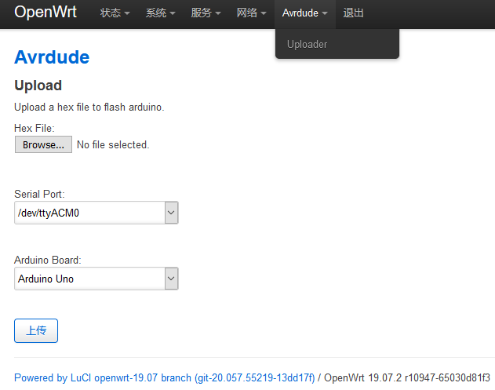

Copy this directory to "feeds/luci/applications/luci-app-avrdude".

Update and install feeds:

```bash
./scripts/feeds update luci
./scripts/feeds install -a -p luci
```

make menuconfig:

```bash
make menuconfig
```

Add luci-app-avrdude and kmod-usb-acm(for Arduino UNO R3):

```
Prompt: luci-app-avrdude........... LuCI Support for avrdude
Location:
    -> LuCI
        -> 3. Applications
```

```
Prompt: kmod-usb-acm.... Support for modems/isdn controllers
Location:
    -> Kernel modules
        -> USB Support
```

make

```bash
make v=99
```

Update firmware.



This project is based on [使用OpenWRT路由远程给Arduino下载程序](https://www.geek-workshop.com/thread-5816-1-1.html).

